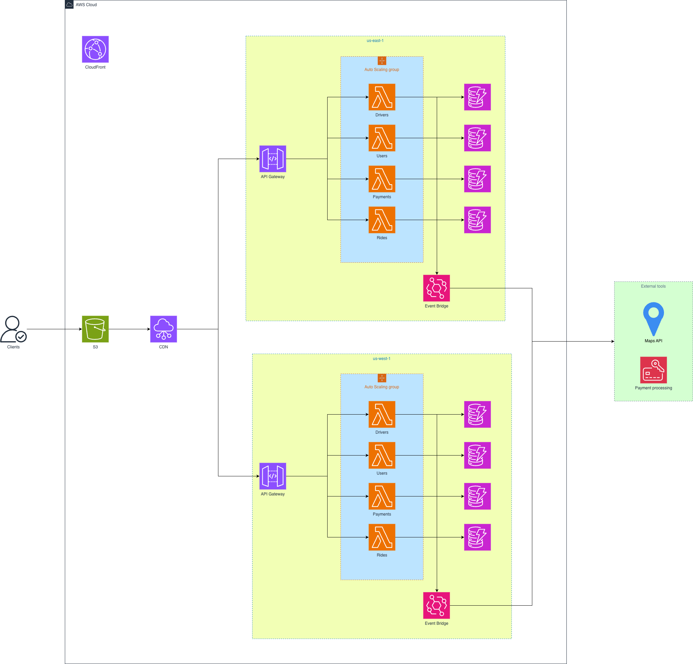

# MiniUber - Microservice Architecture for a Ride-Sharing Platform — Prototype

## Overview

This repository contains a small prototype and design for a ride-sharing microservice platform (a simplified Uber-like system). The project models core domain objects (rides, drivers, users, payments), exposes RESTful endpoints, and proposes an initial beta for a microservice architecture that uses an API Gateway, Lambda functions for light orchestration, and some other cloud services.

---

## Design metaphor

Think of the system as a set of cooperative agents:
- API Gateway agents (API Gateway + Lambdas) handle Ride Service, Driver Service, Payment Service and User Service.
- Messaging agents like SNS decouples services and propagate events (ride state updates, payment events).
- Real-time agents (EventBridge) to push driver-location and ride updates to clients.
- Storage agents (DynamoBD) to hold each microservice information as needed.

---

## Domain model


Key domain objects and important fields (simplified):

- Ride
  - id: string
  - user: User
  - driver: Driver
  - from: string
  - to: string

- User
  - id: string
  - name: string
  - email: string
  - score: double

- Driver
  - id, name, vehicle: {plate, model}, status: enum {AVAILABLE, UNAVAILABLE}, currentLocation
 
- Driver
  - id: string
  - name: string
  - email: string
  - state: enum {AVAILABLE, IN_A_RIDE, BANNED}
  - rides: Ride[]

- Payment
  - id, rideId, amount, method, status: enum {PENDING, COMPLETED, FAILED}
- Payment
  - id: string
  - price: double
  - ride: Ride
  - state: enum {PLACED, PAYED, REJECTED}

---

## API: Resource URIs and HTTP methods

Rides
- GET     /ride — get all rides
- GET     /ride/{rideId} — get ride details
- POST    /ride — create a new ride request (returns ride resource location in header)
- PATCH   /ride — update mutable ride fields (cancel ride, update destination before match, etc.)
- DELETE  /ride/{rideId} — deletes the ride registry

Drivers
- GET     /driver — get all drivers
- GET     /driver/{driverId} — get driver details
- POST    /driver — create a new driver profile (returns ride resource location in header)
- PATCH   /driver — update mutable driver fields (update driver availability)
- DELETE  /driver/{driverId} — deletes the driver registry

Users
- GET     /user — get all users
- GET     /user/{userId} — get user details
- POST    /user — create a new user profile (returns ride resource location in header)
- PATCH   /user — update mutable user fields (improving/decreasing in score)
- DELETE  /user/{userId} — deletes the user registry

Payments
- POST /api/v1/payments — initiate payment for a ride
- GET  /api/v1/payments/{paymentId} — get payment status

- GET     /payment — get payments users
- GET     /payment/{paymentId} — get payment details
- POST    /payment — create a new payment registry (returns ride resource location in header)
- PATCH   /payment — update mutable payment fields (updates payment state)
- DELETE  /payment/{paymentId} — deletes the payment registry

---

## Resource representations

All resources use JSON for request and response bodies.

Example: User creation request

```zsh
{
    "name": "Daniel",
    "email": "abc@xyz.com",
    "score": 4.5
}
```

Example: User response

```zsh
{
    "id": 1879023293,
    "name": "Daniel",
    "email": "abc@xyz.com",
    "score": 4.5
}
```

---

## Microservice architecture (high level)



This section describes the cloud components and responsibilities used in the proposed architecture.

- S3 — object storage for static assets (diagrams, client bundle, logs backups).
- CDN (CloudFront) — edge caching for static assets and optional API caching to reduce latency for common GETs.
- CloudWatch — centralized observability platform for the stack. Responsibilities:
  - Collect logs (CloudWatch Logs) from Lambda, API Gateway access logs, ECS/EC2 agents and custom app logs.
- API Gateway (REST + WebSocket) — single public entry point for client traffic; routes REST calls to services/Lambdas and manages WebSocket connections for real-time updates.
- Lambda functions — lightweight, short-lived functions used for authentication, validation, webhook adapters, and small orchestration tasks.
- Core microservices (run on EC2 / ECS / EKS) — stateful or long-running services that own business logic and data. Example services:
  - Ride Service — manages ride lifecycle, state transitions and matching logic.
  - Driver Service — driver profiles, availability state and location management.
  - User Service — user profiles, account management and basic auth integration.
  - Payment Service — payment initiation, reconciliation and integration with a payment provider.
- Messaging / Event bus — EventBridge, SNS/SQS, or Kafka to publish domain events (RideRequested, RideMatched, PaymentCompleted) and decouple services for asynchronous processing.
- Datastores — service-specific databases following the bounded-context principle. Examples: DynamoDB for driver/location data and RDS for relational transactional data. Use the right tool per service's consistency and query needs.

Sequence example (ride request):
1. Client POSTs `/api/v1/rides` to API Gateway.
2. API Gateway invokes a Lambda for authentication/validation (optional) and forwards the request to the Ride Service.
3. Ride Service persists the request and publishes a `RideRequested` event to the event bus.
4. Driver Service consumes the event and notifies nearby available drivers (via push notifications or WebSocket messages).
5. A driver accepts; Driver Service confirms acceptance and Ride Service updates the ride to `MATCHED` and notifies both client and driver via WebSocket.
6. Ride completes; Payment Service charges the rider and publishes `PaymentCompleted`.

Real-time considerations
- Use WebSocket (via API Gateway or a dedicated socket cluster) for low-latency driver location updates and ride events.
- To scale, aggregate/ sample location updates at the client or edge; consider a dedicated streaming pipeline for telemetry.

---

## What this prototype contains

- Java + Maven code under `src/` implementing domain models, controllers and a simple persistence layer for demonstration.
- REST controllers that expose the routes described earlier.
- Unit tests under `src/test` covering core domain behaviors.
- Visual diagrams in `src/main/resources/static/` (or `static/`) for class diagrams and architecture.

This repository is a prototype and educational artifact — it prioritizes clarity over production-ready concerns such as security, multi-region deployment, and hardened observability.

---

## Running locally

Build the project and run the service locally (defaults may vary depending on branch/config in the repo):

```zsh
# Build package
./mvnw clean package

# Run with Maven (dev)
./mvnw spring-boot:run

# Or run the packaged jar
java -jar target/taller3aygo-0.0.1-SNAPSHOT.jar
```

Default base URL: `http://localhost:8080/api/v1` (confirm in `application.yaml` or `src/main/resources` if changed).

Run tests:

```zsh
./mvnw test
```

---

## Deployment notes (prototype -> cloud)

Suggested deployment pattern used for the design:

- Use API Gateway to expose REST and WebSocket endpoints.
- Use Lambda functions for light orchestration, auth and webhook endpoints.
- Host stateful microservices on EC2, ECS, or EKS (Ride Service / Driver Service / Payment Service).
- Use managed DBs (RDS or DynamoDB) per service to enforce bounded contexts.
- Use SNS/SQS (or Kafka) for decoupled event propagation and to implement eventual consistency.
- Monitor with CloudWatch, set up alarms on error rates and latencies.

---


